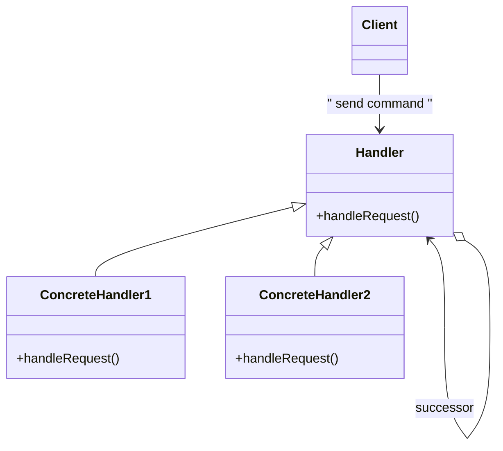

# Chain of Responsibility Pattern

The Chain of Responsibility Pattern is a behavioral design pattern that allows a request to be passed along a chain of handlers. Each handler processes the request or passes it to the next handler in the chain.

---

## 📖 What is the Chain of Responsibility Pattern?

The Chain of Responsibility Pattern allows you to decouple the sender of a request from its receivers by giving multiple objects the opportunity to handle the request. The request travels along the chain until one of the handlers processes it.

Key features:
1. **Decoupling**: Reduces coupling between the sender and receivers of the request.
2. **Flexible Workflow**: Handlers can be added, removed, or reordered without affecting other parts of the code.
3. **Dynamic Handling**: Allows requests to be processed by multiple handlers in sequence.

---

## 🤔 Why Use the Chain of Responsibility Pattern?

1. **Dynamic Request Handling**: When multiple handlers can handle a request, and the decision is made at runtime.
2. **Maintainability**: Simplifies code by avoiding hardcoded conditionals.
3. **Extensibility**: Easily extend the chain by adding new handlers.

---

## 🔧 Implementation

The implementation of the Chain of Responsibility Pattern can be found in:
- [`Chain.java`](./Chain.java): Interface defining the chain's responsibilities.
- [`Numbers.java`](./Numbers.java): Represents the input data.
- [`AddNumbers.java`](./AddNumbers.java), [`SubtractNumbers.java`](./SubtractNumbers.java), [`MultNumbers.java`](./MultNumbers.java), [`DivideNumbers.java`](./DivideNumbers.java): Concrete handlers.
- [`Main.java`](./Main.java): Demonstrates the usage of the Chain of Responsibility Pattern.

---

## 🛠️ Example Usage

To see the Chain of Responsibility Pattern in action, refer to the [`Main.java`](./Main.java) file. It demonstrates a chain of handlers performing mathematical operations based on the input.

---

## 🌐 Real-World Examples

- **Logging Frameworks**:
  - Messages are passed through a chain of loggers with different log levels (INFO, DEBUG, ERROR).
- **Request Processing Pipelines**:
  - HTTP requests processed by a chain of filters in web applications.
- **Event Handling**:
  - GUI frameworks often use this pattern to pass events like mouse clicks to appropriate handlers.

---

## 📊 UML Diagram

> [!NOTE]
> If the UML above is not rendering correctly, you can view the diagram from the [`chain-of-responsibility_uml.png`](./chain-of-responsibility_uml.png) file.
---

## 📝 Key Takeaways

- The Chain of Responsibility Pattern allows requests to be processed by a chain of handlers.
- It decouples the sender of a request from its receivers, promoting flexibility and extensibility.
- Use it when multiple objects can handle a request, and the handler isn't known in advance.

---
