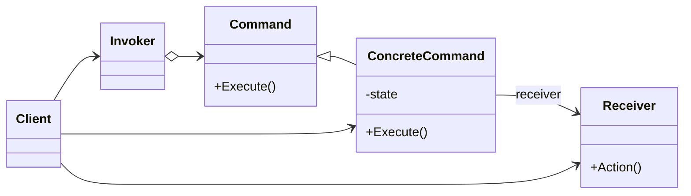

# Command Pattern

The Command Pattern is a behavioral design pattern that encapsulates a request as an object, thereby allowing you to parameterize objects with requests, delay their execution, or support undoable operations.

---

## 📖 What is the Command Pattern?

The Command Pattern encapsulates a request as an object. It separates the object that invokes the operation from the one that knows how to perform it.

Key features:
1. **Encapsulation**: Encapsulates a request as an object.
2. **Decoupling**: Decouples the invoker and the receiver.
3. **Undo/Redo**: Provides support for undoable operations.

---

## 🔧 Implementation

The implementation of the Command Pattern can be found in:
- [`Command.java`](./Command.java): The interface for all commands.
- [`Light.java`](./Light.java): The receiver class.
- [`LightOnCommand.java`](./LightOnCommand.java), [`LightOffCommand.java`](./LightOffCommand.java): Concrete command implementations.
- [`RemoteControl.java`](./RemoteControl.java): The invoker class.
- [`Main.java`](./Main.java): Demonstrates the usage of the Command Pattern.

---

## 🛠️ Example Usage

To see the Command Pattern in action, refer to the [`Main.java`](./Main.java) file. It demonstrates controlling a light using commands.

---

## 📊 UML Diagram

> [!NOTE]
> If the UML above is not rendering correctly, you can view the diagram from the [`command_uml.png`](./command_uml.png) file.
---

## 📝 Key Takeaways
- The Command Pattern encapsulates a request as an object, allowing you to parameterize objects with requests.
- It decouples the invoker from the receiver, providing support for undoable operations.
- Use it when you need to support operations such as undo, redo, or queuing requests. 