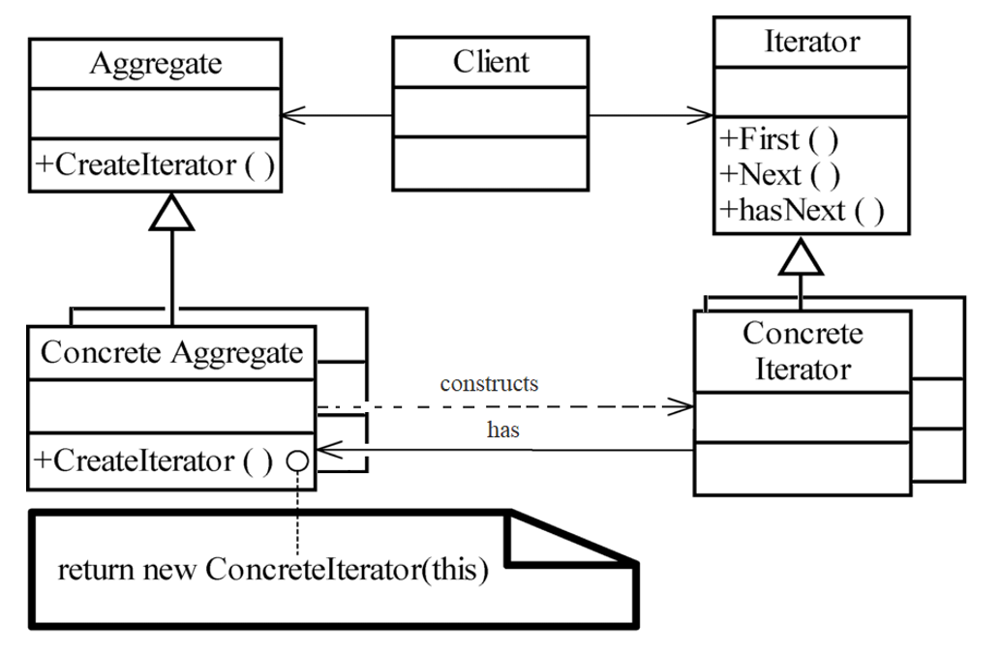

# Iterator Pattern

The Iterator Pattern is a behavioral design pattern that provides a way to access the elements of a collection sequentially without exposing its underlying representation.

---

## 📖 What is the Iterator Pattern?

The Iterator Pattern decouples the iteration logic from the collection itself. It provides a standard interface for traversing a collection without knowing its internal structure.

Key features:
1. **Encapsulation**: Hides the complexity of traversal logic.
2. **Consistency**: Provides a standard way to access elements.
3. **Flexibility**: Supports different types of collections.

---

## 🤔 Why Use the Iterator Pattern?

1. **Abstraction**: Decouples iteration logic from the collection's internal structure.
2. **Flexibility**: Supports multiple ways to traverse a collection.
3. **Readability**: Simplifies code by abstracting traversal logic.

---

## 🔧 Implementation

The implementation of the Iterator Pattern can be found in:
- [`Iterator.java`](./Iterator.java): Interface defining the traversal methods.
- [`Collection.java`](./Collection.java): Represents a collection of elements.
- [`ConcreteIterator.java`](./ConcreteIterator.java): Concrete implementation of the iterator.
- [`ConcreteCollection.java`](./ConcreteCollection.java): Concrete implementation of the collection.
- [`Main.java`](./Main.java): Demonstrates the usage of the Iterator Pattern.

---

## 🛠️ Example Usage

To see the Iterator Pattern in action, refer to the [`Main.java`](./Main.java) file. It demonstrates traversing a collection using an iterator.

---

## 🌐 Real-World Examples

- **Java Collections Framework**:
  - Iterators are used to traverse collections like `ArrayList` or `HashSet`.
- **Game Development**:
  - Traversing game objects or scenes in a game engine.

---

## 📊 UML Diagram

Here’s the UML representation of the Iterator Pattern:

---

## 📝 Key Takeaways

- The Iterator Pattern separates traversal logic from the collection's structure.
- It simplifies traversal and supports multiple traversal algorithms.
- Use it when you need to access elements of a collection without exposing its internals.

---
