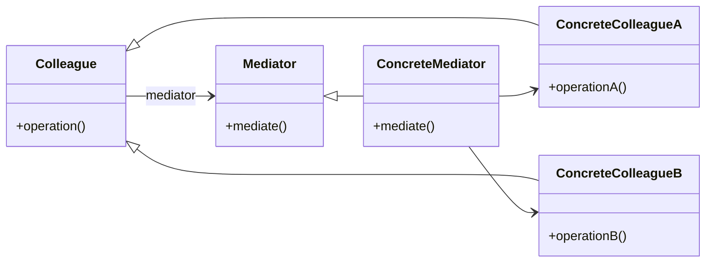

# Mediator Pattern

The Mediator Pattern is a behavioral design pattern that defines an object (the Mediator) to encapsulate how a set of objects interact, promoting loose coupling by preventing direct communication between objects.

---

## 📖 What is the Mediator Pattern?

The Mediator Pattern centralizes communication between a group of objects by introducing a mediator object. Instead of objects referring to each other directly, they communicate through the mediator.

Key features:
1. **Centralized Communication**: Mediator manages interactions between colleagues.
2. **Loose Coupling**: Reduces dependencies between objects.
3. **Simplifies Object Relationships**: Avoids tight interconnections between objects.

---

## 🔧 Implementation

- [`Mediator`](./mediator.java) defines an interface for communicating with colleague objects.
- [`Colleague`](./colleague.java) defines an interface for interacting with the mediator.
- [`Plane`](./plane.java) concrete implementation of the `Colleague` interface.
- [`AirTrafficControl`](./air_traffic_control.java) concrete implementation of the `Mediator` interface.
- [`Main`](./main.java) demonstrates the Mediator Pattern.

---

## 📊 UML Diagram

> [!NOTE]
> If the UML above is not rendering correctly, you can view the diagram from the [`mediator_uml.png`](./mediator_uml.png) file.

---

## Key Takeaways
- **Centralized Communication**: The Mediator Pattern centralizes communication between objects.
- **Loose Coupling**: Objects interact through the mediator, reducing direct dependencies.
- **Simplifies Object Relationships**: Avoids complex interconnections between objects.
- **Promotes Reusability**: Encourages reuse of individual components.