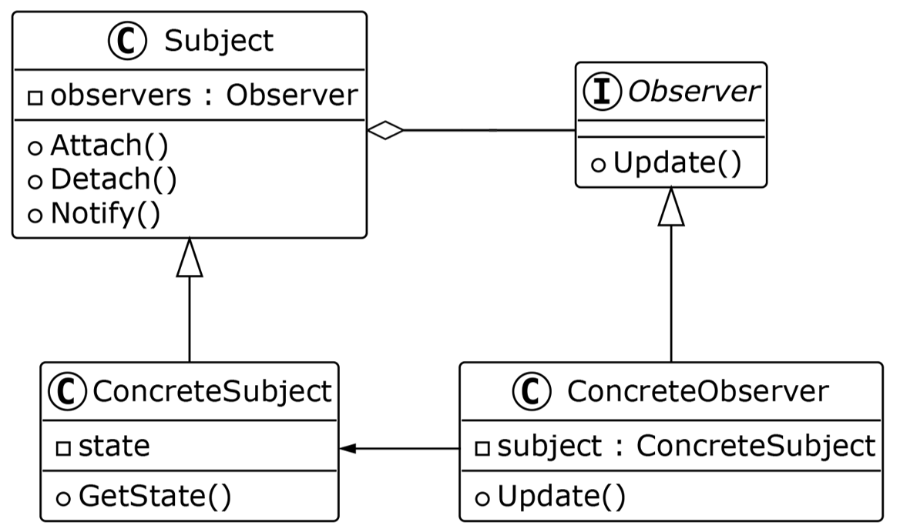

# Observer Pattern

The Observer Pattern is a behavioral design pattern that establishes a one-to-many dependency between objects. When one object (the subject) changes state, all its dependents (observers) are notified and updated automatically.

---

## 📖 What is the Observer Pattern?

The Observer Pattern allows objects to observe and react to changes in another object. The subject maintains a list of observers and notifies them whenever there is a change in its state.

Key features:
1. **One-to-Many Relationship**: Updates all observers when the subject changes.
2. **Decoupling**: Reduces coupling between the subject and observers.
3. **Dynamic Updates**: Observers can dynamically register and unregister.

---

## 🤔 Why Use the Observer Pattern?

1. **Real-Time Updates**: Keep multiple objects in sync with a central subject.
2. **Flexibility**: Observers can be added or removed dynamically.
3. **Decoupled Design**: Promotes loose coupling between the subject and its observers.

---

## 🔧 Implementation

The implementation of the Observer Pattern can be found in:
- [`Subject.java`](./Subject.java): Defines the subject interface.
- [`Observer.java`](./Observer.java): Defines the observer interface.
- [`WeatherData.java`](./WeatherData.java): Concrete subject implementation.
- [`CurrentConditionsDisplay.java`](./CurrentConditionsDisplay.java), [`StatisticsDisplay.java`](./StatisticsDisplay.java), [`ForecastDisplay.java`](./ForecastDisplay.java): Concrete observer implementations.
- [`WeatherStation.java`](./WeatherStation.java): Main class to demonstrate the Observer Pattern.

---

## 🛠️ Example Usage

To see the Observer Pattern in action, refer to the [`WeatherStation.java`](./WeatherStation.java) file. It demonstrates how weather data is updated and displayed in real-time.

---

## 📊 UML Diagram

Here’s the UML representation of the Observer Pattern:

---

## 📝 Key Takeaways

- The Observer Pattern is ideal for real-time updates between objects.
- It reduces coupling and increases flexibility in your codebase.
- Use it when you need to maintain consistency between related objects.

---
