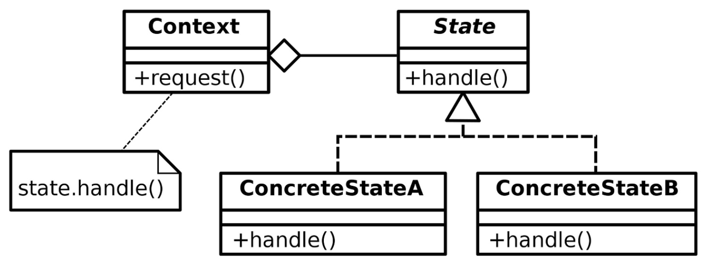

# State Pattern

The State Pattern is a behavioral design pattern that allows an object to change its behavior when its internal state changes. It helps an object behave differently depending on its current state.

---

## 📖 What is the State Pattern?

The State Pattern allows an object to alter its behavior when its internal state changes. Instead of using numerous `if` or `switch` statements, the pattern encapsulates state-specific behavior in separate state classes.

Key features:
1. **Encapsulation of State**: Encapsulates state-specific behavior in separate classes.
2. **Dynamic Behavior**: Allows objects to change behavior dynamically at runtime.
3. **Simplified Code**: Eliminates complex conditional logic.

---

## 🤔 Why Use the State Pattern?

1. **Dynamic State Changes**: When an object's behavior needs to change based on its state.
2. **Maintainability**: Avoids bloated code with multiple `if-else` or `switch` statements.
3. **Scalability**: Easily add new states without modifying existing state classes.

---

## 🔧 Implementation

The implementation of the State Pattern can be found in:
- [`Gate.java`](./Gate.java): The context class that delegates actions to its current state.
- [`GateState.java`](./GateState.java): The interface for all state classes.
- [`ClosedState.java`](./ClosedState.java), [`OpenState.java`](./OpenState.java): Concrete state classes.
- [`TestDrive.java`](./TestDrive.java): Demonstrates the usage of the State Pattern.

---

## 🛠️ Example Usage

To see the State Pattern in action, refer to the [`TestDrive.java`](./TestDrive.java) file. It demonstrates a gate system where the gate's behavior changes dynamically based on its state.

---

## 📊 UML Diagram

Here’s the UML representation of the State Pattern:

---

## 📝 Key Takeaways

- The State Pattern is ideal when an object needs to alter its behavior based on its internal state.
- It promotes encapsulation and simplifies the codebase by avoiding conditional logic.
- Use it when objects have complex state-dependent behavior.

---
