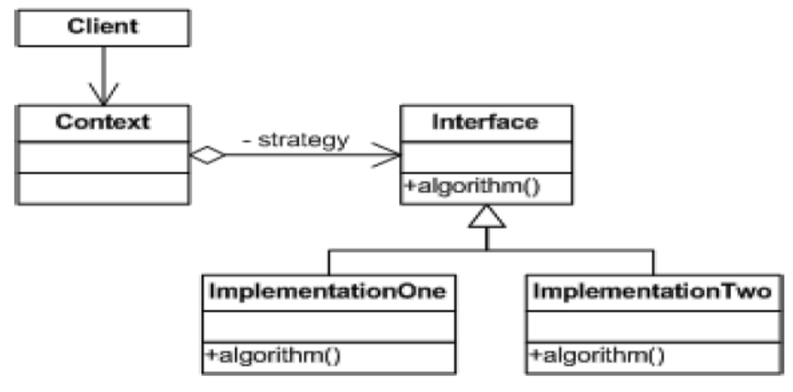

# Strategy Pattern

The Strategy Pattern is a behavioral design pattern that defines a family of algorithms, encapsulates each one, and makes them interchangeable. It allows the algorithm to vary independently from the clients that use it.

---

## 📖 What is the Strategy Pattern?

The Strategy Pattern encapsulates algorithms into individual classes and allows objects to dynamically switch between them at runtime.

Key features:
1. **Encapsulation**: Encapsulates related algorithms into separate classes.
2. **Flexibility**: Allows dynamic swapping of algorithms during runtime.
3. **Open/Closed Principle**: Supports adding new algorithms without modifying existing code.

---

## 🤔 Why Use the Strategy Pattern?

1. **Dynamic Behavior**: When the behavior of an object needs to change dynamically.
2. **Avoid Conditional Logic**: Eliminates the need for multiple `if-else` or `switch` statements.
3. **Reusability**: Promotes reusability by isolating algorithms in their own classes.

---

## 🔧 Implementation

The implementation of the Strategy Pattern can be found in:
- [`FlyBehavior.java`](./FlyBehavior.java), [`QuackBehavior.java`](./QuackBehavior.java): Interfaces defining different behaviors.
- [`FlyWithWings.java`](./FlyWithWings.java), [`FlyNoWay.java`](./FlyNoWay.java): Concrete flying behaviors.
- [`Quack.java`](./Quack.java), [`Squeak.java`](./Squeak.java): Concrete quacking behaviors.
- [`Duck.java`](./Duck.java): Base class for ducks, delegating behaviors to strategy objects.
- [`RubberDuck.java`](./RubberDuck.java), [`MallardDuck.java`](./MallardDuck.java): Concrete ducks with specific behaviors.
- [`Main.java`](./Main.java): Demonstrates the usage of the Strategy Pattern.

---

## 🛠️ Example Usage

To see the Strategy Pattern in action, refer to the [`Main.java`](./Main.java) file. It demonstrates how ducks dynamically change their flying and quacking behaviors.

---

## 🌐 Real-World Examples

- **Sorting Algorithms**:
  - Switching between different sorting strategies (e.g., QuickSort, MergeSort) at runtime.
- **Payment Systems**:
  - Dynamically selecting a payment method (e.g., credit card, PayPal) at checkout.
- **Game Characters**:
  - Allowing characters to change behaviors dynamically (e.g., attack, defend).

---

## 📊 UML Diagram

Here’s the UML representation of the Strategy Pattern:

---

## 📝 Key Takeaways

- The Strategy Pattern encapsulates algorithms and allows them to be interchangeable.
- It simplifies code by removing complex conditional logic.
- Use it when objects need to support a variety of interchangeable behaviors.

---
