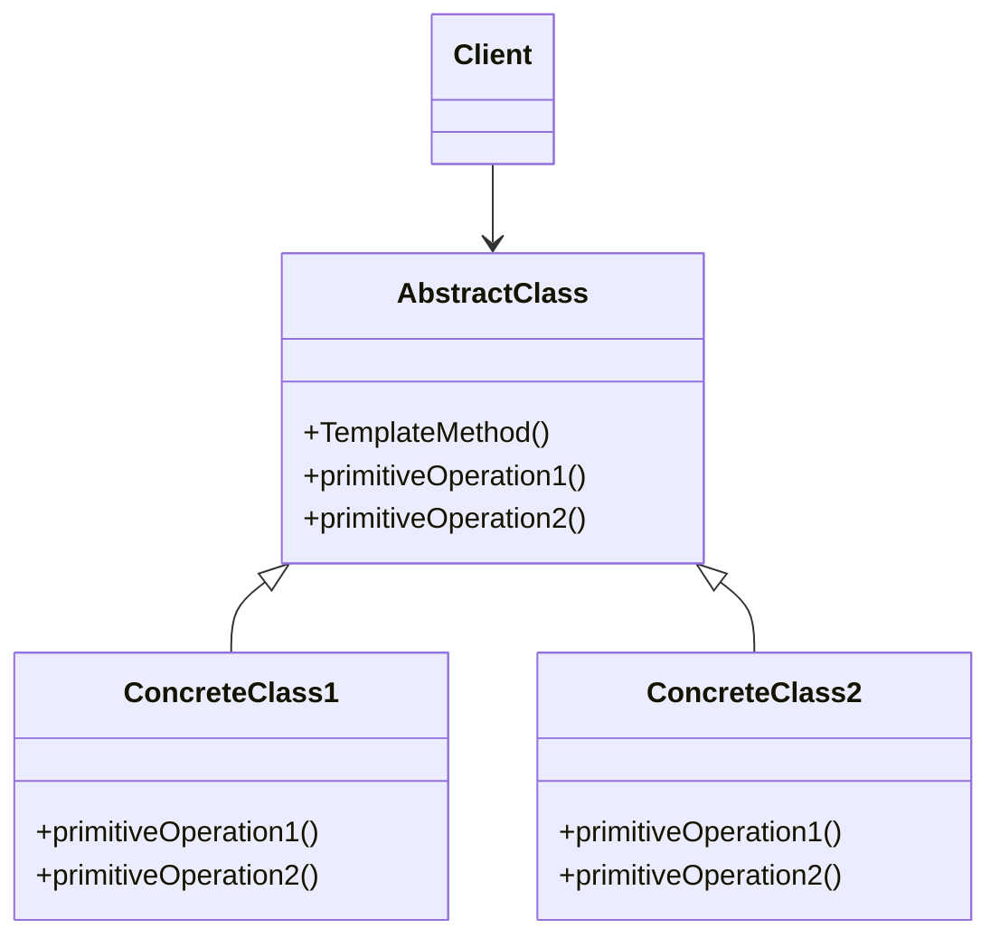

# Template Method Pattern

The Template Method Pattern is a behavioral design pattern that defines the skeleton of an algorithm in a base class and allows subclasses to override specific steps of the algorithm without changing its structure.

---

## 📖 What is the Template Method Pattern?

The Template Method Pattern defines the overall structure of an algorithm in a base class and delegates some specific steps to subclasses. This ensures that the algorithm's structure remains unchanged, while individual steps can vary.

Key features:
1. **Code Reuse**: Common algorithm structure is defined once in the base class.
2. **Flexibility**: Subclasses can modify specific steps without altering the algorithm.
3. **Consistency**: Ensures the overall structure of the algorithm remains consistent.

---

## 🤔 Why Use the Template Method Pattern?

1. **Shared Structure**: When multiple classes share a common algorithm structure but differ in details.
2. **Avoid Code Duplication**: Reduce duplication by defining reusable templates.
3. **Flexibility**: Allow subclasses to provide custom implementations for specific steps.

---

## 🔧 Implementation

The implementation of the Template Method Pattern can be found in:
- [`CaffeineBeverage.java`](./CaffeineBeverage.java): Abstract class that defines the template method.
- [`Tea.java`](./Tea.java): Concrete implementation for tea preparation.
- [`Coffee.java`](./Coffee.java): Concrete implementation for coffee preparation.

---

## 🛠️ Example Usage

To see the Template Method Pattern in action, refer to the [`Main.java`](./Main.java) file. It demonstrates how to prepare tea and coffee using the template method.

---

## 📊 UML Diagram

> [!NOTE]
> If the UML above is not rendering correctly, you can view the diagram from the [`template-method_uml.png`](./template-method_uml.png) file.

---

## 📝 Key Takeaways

- The Template Method Pattern is ideal when multiple classes share a common algorithm structure with varying details.
- It promotes code reuse and ensures consistency in the algorithm.
- Use it when you want to define a reusable algorithm skeleton with customizable steps.

---
