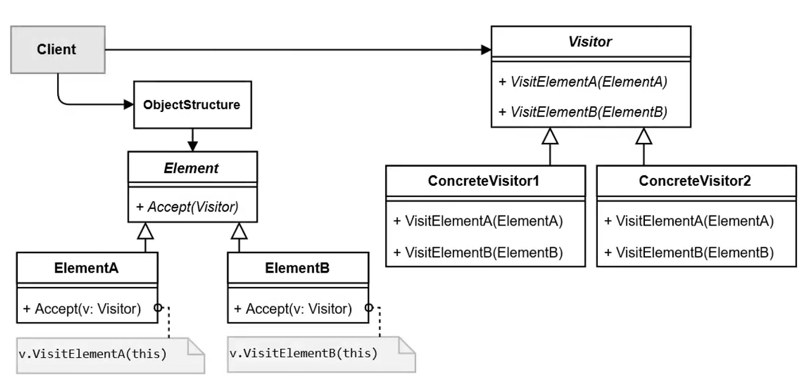

# Visitor Pattern

The Visitor Pattern is a behavioral design pattern that allows you to add new operations to objects without changing their structure. It separates an algorithm from the objects it operates on.

---

## 📖 What is the Visitor Pattern?

The Visitor Pattern involves two key elements: 
1. **Visitor**: Defines a set of operations to be performed on elements of an object structure.
2. **Element**: Defines an `accept()` method that allows the visitor to access its data.

Key features:
1. **Open/Closed Principle**: Allows adding new operations without modifying existing classes.
2. **Double Dispatch**: Executes the operation on the visitor while providing access to the element's state.
3. **Extensibility**: Supports adding new operations to existing structures.

---

## 🤔 Why Use the Visitor Pattern?

1. **Extending Behavior**: Add new operations without changing the classes of the elements.
2. **Separation of Concerns**: Keeps the logic for specific operations separate from the elements.
3. **Consistency**: Ensures operations are applied consistently across similar objects.

---

## 🔧 Implementation

The implementation of the Visitor Pattern can be found in:
- [`Figure.java`](./Figure.java): Defines the base interface for figures.
- [`Circle.java`](./Circle.java), [`Triangle.java`](./Triangle.java), [`Square.java`](./Square.java): Concrete elements implementing the `accept()` method.
- [`FigureVisitor.java`](./FigureVisitor.java): Visitor interface defining operations for all figure types.
- [`HeightVisitor.java`](./HeightVisitor.java), [`AreaVisitor.java`](./AreaVisitor.java): Concrete visitors implementing specific behaviors.
- [`ObjectStructure.java`](./ObjectStructure.java): Manages the collection of figures.
- [`Main.java`](./Main.java): Demonstrates the usage of the Visitor Pattern.

---

## 🛠️ Example Usage

To see the Visitor Pattern in action, refer to the [`Main.java`](./Main.java) file. It demonstrates how a collection of figures can be traversed, applying different visitor behaviors.

---

## 🌐 Real-World Examples

- **Compilers**:
  - Applying different operations like code generation or optimization to syntax trees.
- **Graphic Editors**:
  - Rendering, exporting, or analyzing shapes in an editor.
- **File Systems**:
  - Performing operations like compression or indexing on files and folders.

---

## 📊 UML Diagram

Here’s the UML representation of the Visitor Pattern:

---

## 📝 Key Takeaways

- The Visitor Pattern separates algorithms from the objects they operate on, adhering to the Open/Closed Principle.
- It’s ideal for applying operations to a collection of objects with varying types.
- Use it when you need to perform multiple unrelated operations on objects without modifying their structure.

---
