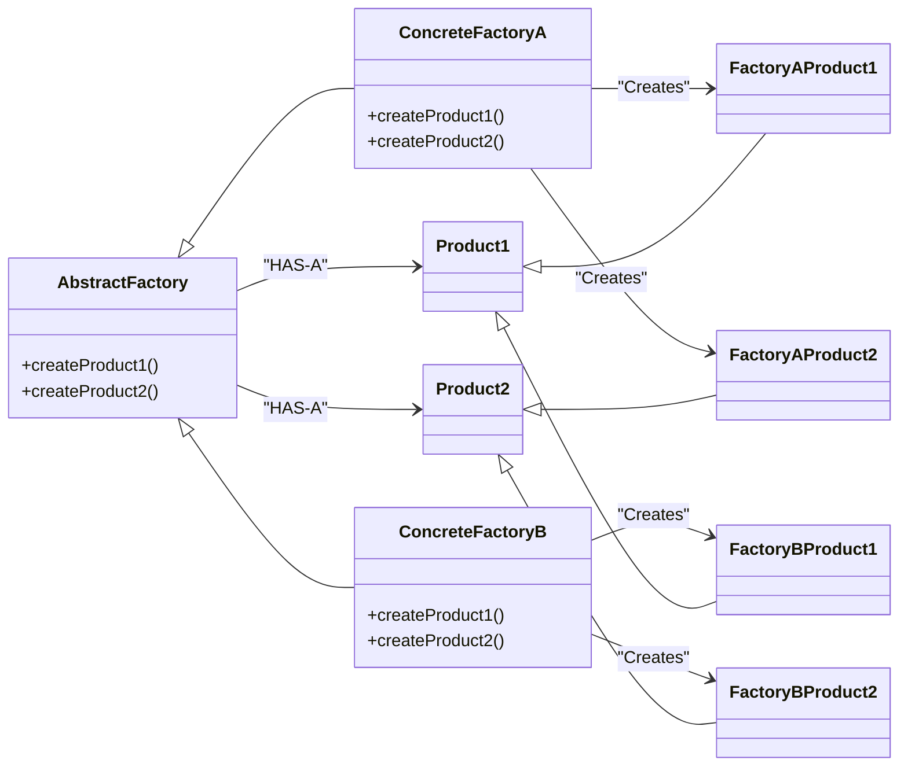

# Abstract Factory Pattern

The Abstract Factory Pattern is a creational design pattern that provides an interface for creating families of related or dependent objects without specifying their concrete classes.

---

## 📖 What is the Abstract Factory Pattern?

The Abstract Factory Pattern works as a factory of factories. Instead of creating one object, it allows the creation of multiple related objects within a family. It ensures that all objects created by a factory are compatible with each other.

Key features:
1. **Family of Objects**: Creates families of related objects.
2. **Encapsulation of Object Creation**: The client code only depends on the factory interface, not the concrete implementations.
3. **Flexibility**: Adding new product families requires creating new factories without modifying existing code.

---

## 🤔 Why Use the Abstract Factory Pattern?

1. **Consistency**: Ensures that related objects are compatible with each other.
2. **Scalability**: Easily extendable to new families of related objects.
3. **Separation of Concerns**: Encapsulates object creation logic in factories, keeping the client code simple and decoupled.

---

## 🔧 Implementation

The implementation of the Abstract Factory Pattern can be found in:
- [`GUIFactory.java`](./GUIFactory.java): Abstract factory interface for creating GUI components.
- [`WinFactory.java`](./WinFactory.java) and [`MacFactory.java`](./MacFactory.java): Concrete factories for Windows and macOS GUI components.
- [`Button.java`](./Button.java) and [`Checkbox.java`](./Checkbox.java): Abstract products.
- [`WinButton.java`](./WinButton.java), [`MacButton.java`](./MacButton.java), [`WinCheckbox.java`](./WinCheckbox.java), [`MacCheckbox.java`](./MacCheckbox.java): Concrete products.
- [`Application.java`](./Application.java): Demonstrates the usage of the Abstract Factory Pattern.
---

## 🛠️ Example Usage

To see the Abstract Factory Pattern in action, refer to the [`Game.java`](./Game.java) file. It demonstrates how different themed factories can be used to create families of related objects dynamically.

---

## 🌐 Real-World Examples

- **GUI Toolkits**:
  - A factory creates GUI components (e.g., buttons, scrollbars, windows) that match a particular operating system or theme (e.g., Windows, macOS, Linux).
- **Game Development**:
  - Different worlds or levels in a game may require families of related objects (e.g., enemies, power-ups, obstacles) based on the theme.

---

## 📊 UML Diagram

> [!NOTE]
> If the UML above is not rendering correctly, you can view the diagram from the [`abstract-factory_uml.png`](./abstract-factory_uml.png) file.
---

## 📝 Key Takeaways

- The Abstract Factory Pattern is ideal for creating families of related or dependent objects.
- Use it when multiple object families need to be created, and consistency among them is essential.
- It promotes flexibility and scalability in your application.

---
