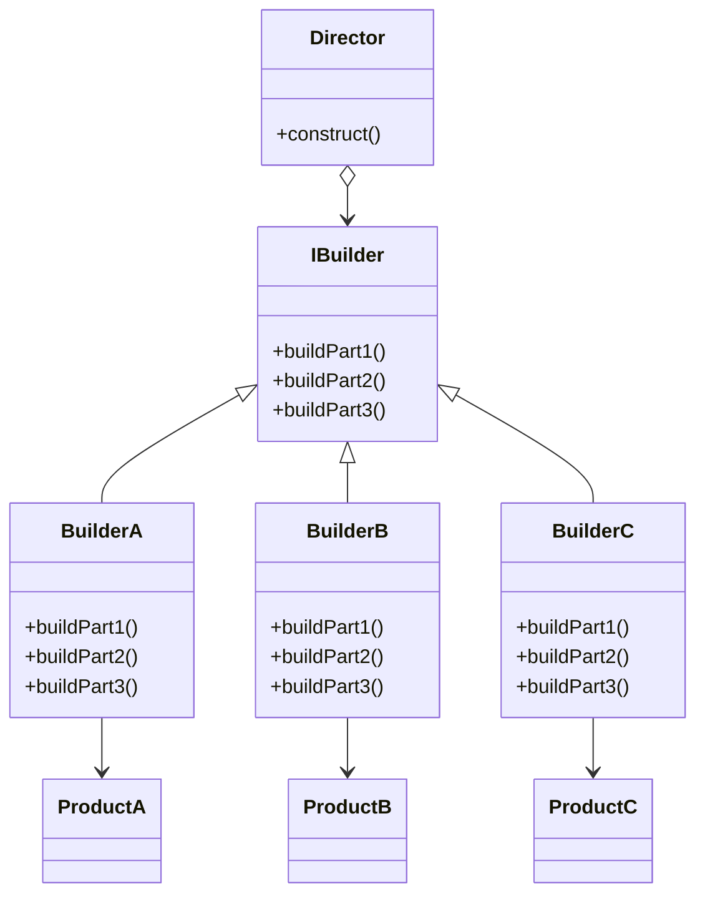

# Builder Pattern

The Builder Pattern is a creational design pattern that allows the construction of complex objects step by step. It separates the construction process from the final representation, enabling the same construction process to create different representations.

---

## 📖 What is the Builder Pattern?

The Builder Pattern involves a **Director** that constructs an object using a **Builder** interface. The Builder defines the steps to construct the object, and concrete builders implement these steps to create specific representations.

Key features:
1. **Step-by-Step Construction**: Breaks down the construction process into smaller, manageable steps.
2. **Reusability**: The same construction process can create different objects with varying attributes.
3. **Flexibility**: Easily customizable by changing or adding new builders.

---

## 🤔 Why Use the Builder Pattern?

1. **Encapsulation**: Separates the construction logic from the representation.
2. **Complex Object Creation**: Simplifies the creation of objects with multiple configurations or variations.
3. **Readability**: Makes the object creation process more intuitive and readable.

---

## 🔧 Implementation

The implementation of the Builder Pattern can be found in:
- [`RobotPlan.java`](./RobotPlan.java): Interface that defines the blueprint for the robot.
- [`Robot.java`](./Robot.java): Concrete product representing the robot.
- [`RobotBuilder.java`](./RobotBuilder.java): Builder interface defining the building steps.
- [`OldRobotBuilder.java`](./OldRobotBuilder.java): Concrete builder for creating an old-school robot.
- [`RobotEngineer.java`](./RobotEngineer.java): Director that constructs the robot using a builder.
- [`TestRobotBuilder.java`](./TestRobotBuilder.java): Demonstrates the usage of the Builder Pattern.

---

## 🛠️ Example Usage

To see the Builder Pattern in action, refer to the [`TestRobotBuilder.java`](./TestRobotBuilder.java) file. It demonstrates how to construct a robot step by step using a concrete builder and a director.

---

## 🌐 Real-World Examples

- **Building UIs**:
  - A builder can construct complex user interfaces step by step.
- **Game Development**:
  - Used for creating complex game characters or objects with configurable attributes (e.g., weapons, armor, abilities).

---

## 📊 UML Diagram

> [!NOTE]
> If the UML above is not rendering correctly, you can view the diagram from the [`builder_uml.png`](./builder_uml.png) file.
---

## 📝 Key Takeaways

- The Builder Pattern is ideal for creating complex objects with multiple attributes.
- It separates the construction process from the final representation.
- Use it when constructing an object step by step enhances clarity and flexibility.

---
