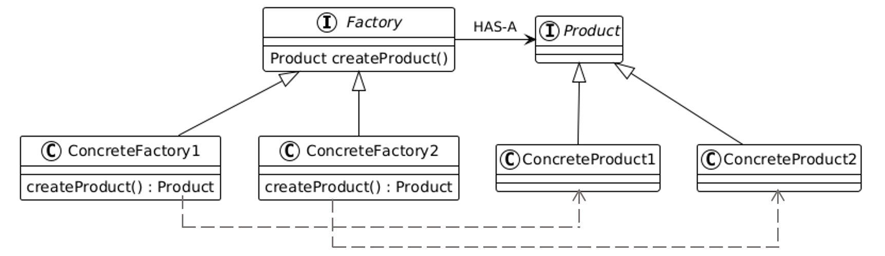

# Factory Method Pattern

The Factory Method Pattern is a creational design pattern that provides an interface for creating objects in a superclass but allows subclasses to alter the type of objects that will be created.

---

## 📖 What is the Factory Method Pattern?

The Factory Method Pattern defines a method that subclasses must override to specify the type of object to create. This promotes loose coupling by reducing the dependency of client code on specific classes.

Key features:
1. **Encapsulation of Object Creation**: The creation logic is moved to a factory method.
2. **Flexibility**: Subclasses can determine what type of object to instantiate.
3. **Polymorphism**: The client interacts with a common interface, not specific implementations.

---

## 🤔 Why Use the Factory Method Pattern?

1. **Customization**: Allows subclasses to change the type of object created without modifying client code.
2. **Scalability**: Makes it easy to introduce new types of objects without altering existing code.
3. **Consistency**: Ensures all objects follow a consistent creation process.

---

## 🔧 Implementation

The implementation of the Factory Method Pattern can be found in:
- [`ObstacleFactory.java`](./ObstacleFactory.java): Abstract factory for creating obstacles.
- [`PowerUpFactory.java`](./PowerUpFactory.java): Abstract factory for creating power-ups.
- [`GoombaFactory.java`](./GoombaFactory.java), [`KoopaFactory.java`](./KoopaFactory.java): Concrete factories for obstacles.
- [`MushroomFactory.java`](./MushroomFactory.java), [`StarFactory.java`](./StarFactory.java): Concrete factories for power-ups.
- [`Game.java`](./Game.java): Demonstrates the usage of the Factory Method Pattern.

---

## 🛠️ Example Usage

To see the Factory Method Pattern in action, refer to the [`Main.java`](./Main.java) file. It demonstrates how to use the factory method to create different types of shapes.

---

## 🌐 Real-World Examples

- **GUI Frameworks**:
  - A dialog class creates buttons using a factory method. Subclasses of the dialog can decide whether to create Windows buttons, macOS buttons, or other types.
- **Data Parsers**:
  - A file reader factory can produce XML, JSON, or CSV parsers based on configuration.

---

## 📊 UML Diagram

Here’s the UML representation of the Factory Method Pattern:

---

## 📝 Key Takeaways

- The Factory Method Pattern provides a way to encapsulate object creation.
- Use it when the client code should not depend on specific classes or object types.
- It promotes flexibility and scalability in your application.

---
