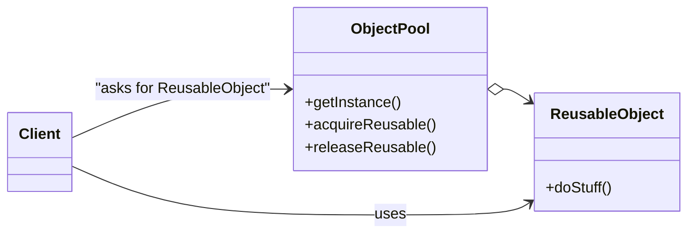

# Object Pool Pattern

The Object Pool Pattern is a creational design pattern that manages a pool of reusable objects. When an object is needed, the pool provides one that is already created or creates a new one if none are available. Once the object is no longer needed, it is returned to the pool.

---

## 📖 What is the Object Pool Pattern?

The Object Pool Pattern focuses on reusing existing objects instead of creating new ones every time they are needed. It is particularly useful when object creation is expensive or when there is a need to limit the number of instantiated objects.

Key features:
1. **Reuse of Objects**: Reduces the overhead of object creation by reusing pre-created objects.
2. **Resource Management**: Controls the lifecycle of objects, ensuring they are efficiently reused and released.
3. **Performance**: Improves application performance by avoiding frequent object creation and destruction.

---

## 🤔 Why Use the Object Pool Pattern?

1. **Efficiency**: Avoids the cost of creating and destroying objects repeatedly.
2. **Performance**: Improves application performance in scenarios with frequent object requests.
3. **Control**: Limits the number of active objects in memory.

---

## 🔧 Implementation

The implementation of the Object Pool Pattern can be found in:
- [`ObjectPool.java`](./ObjectPool.java): The object pool class that manages reusable objects.
- [`Reusable.java`](./Reusable.java): A simple reusable object.
- [`TestObjectPool.java`](./TestObjectPool.java): Demonstrates the usage of the Object Pool Pattern.

---

## 🛠️ Example Usage

To see the Object Pool Pattern in action, refer to the [`TestObjectPool.java`](./TestObjectPool.java) file. It demonstrates how objects can be retrieved from and returned to the pool.

---

## 🌐 Real-World Examples

- **Database Connections**:
  - A connection pool maintains a set of pre-created database connections that can be reused.
- **Thread Management**:
  - A thread pool manages a set of reusable threads for handling tasks.
- **Game Development**:
  - Object pools are used for frequently created and destroyed objects like bullets or enemies.

---

## 📊 UML Diagram

> [!NOTE]
> If the UML above is not rendering correctly, you can view the diagram from the [`object-pool_uml.png`](./object-pool_uml.png) file.
---

## 📝 Key Takeaways

- The Object Pool Pattern is ideal for managing expensive-to-create objects that need to be reused.
- It reduces memory overhead and improves performance.
- Use it when frequent object creation and destruction would hurt performance.

---
