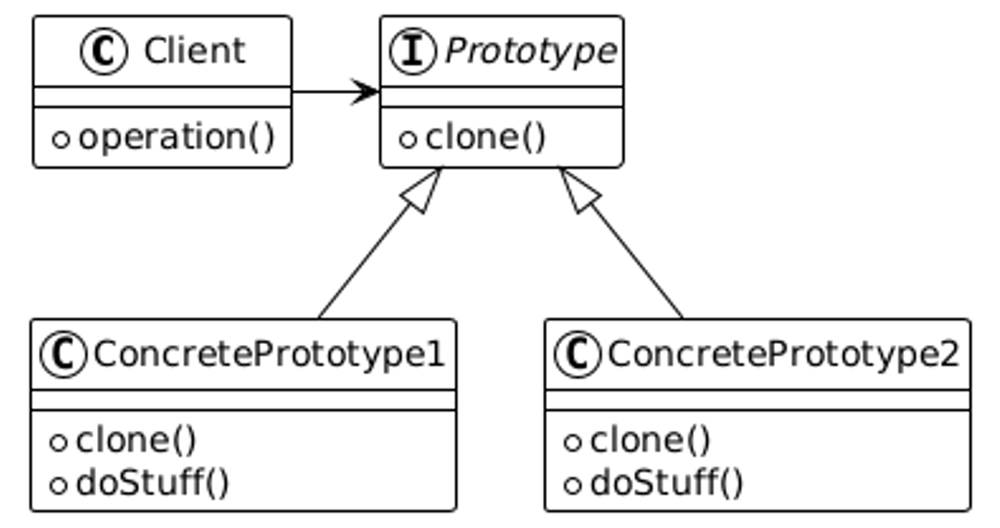

# Prototype Pattern

The Prototype Pattern is a creational design pattern that allows cloning of objects to create new instances without using the `new` keyword. Instead, it relies on the `clone()` method to create copies of objects.

---

## 📖 What is the Prototype Pattern?

The Prototype Pattern enables the creation of new objects by copying existing objects rather than creating new ones from scratch. This is particularly useful when object creation is costly or complex.

Key features:
1. **Cloning**: Creates new objects by cloning existing objects.
2. **Efficiency**: Avoids the overhead of creating objects from scratch.
3. **Decoupling**: Reduces the dependency on specific classes or constructors.

---

## 🤔 Why Use the Prototype Pattern?

1. **Performance**: Reduces the time and resources required to create new objects.
2. **Flexibility**: Allows objects to be cloned with modifications if needed.
3. **Dynamic Object Creation**: Useful for creating objects dynamically during runtime.

---

## 🔧 Implementation

The implementation of the Prototype Pattern can be found in:
- [`Shape.java`](./Shape.java): Prototype interface that defines the cloning method.
- [`Circle.java`](./Circle.java): Concrete prototype for a circle.
- [`Rectangle.java`](./Rectangle.java): Concrete prototype for a rectangle.
- [`TestCloning.java`](./TestCloning.java): Demonstrates the usage of the Prototype Pattern.

---

## 🛠️ Example Usage

To see the Prototype Pattern in action, refer to the [`TestCloning.java`](./TestCloning.java) file. It demonstrates how to create clones of different shapes dynamically during runtime.

---

## 🌐 Real-World Examples

- **Game Development**:
  - Cloning game objects such as enemies or terrain instead of creating them from scratch.
- **GUI Components**:
  - Cloning pre-configured UI elements to maintain consistency.

---

## 📊 UML Diagram

Here’s the UML representation of the Prototype Pattern:

---

## 📝 Key Takeaways

- The Prototype Pattern is ideal for creating new objects by cloning existing ones.
- It reduces the overhead of creating objects from scratch and ensures efficiency.
- Use it when object creation is expensive or when a large number of similar objects need to be created.

---
