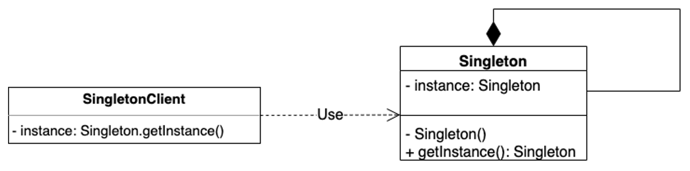

# Singleton Pattern

The Singleton Pattern is one of the simplest and most widely used design patterns in software development. It ensures that a class has only **one instance** and provides a global point of access to that instance.

---

## 📖 What is the Singleton Pattern?

The Singleton Pattern restricts the instantiation of a class to **a single object**. This is useful when exactly one object is needed to coordinate actions across the system, such as:
- Managing shared resources (e.g., database connections, logging frameworks).
- Controlling access to a global state or configuration.

Key features:
1. **Global Access**: The single instance is accessible globally.
2. **Controlled Instantiation**: Prevents external instantiation of the class.

---

## 🤔 Why Use the Singleton Pattern?

1. **Consistency**: Ensures there is only one instance of a class across the application.
2. **Resource Management**: Avoids overhead caused by multiple object instantiations (e.g., connection pooling).
3. **Ease of Access**: Provides a single point of access for certain behaviors or data.

---

## 🔧 Implementation

The implementation of the Singleton Pattern can be found in **`PrinterSpooler.java`**. This class ensures only one instance of the printer spooler is created and provides a global point of access to it.

To explore the implementation, refer to:
- [`PrinterSpooler.java`](./PrinterSpooler.java): The Singleton class.
- [`Main.java`](./Main.java): Demonstrates the usage of the Singleton Pattern.

---

## 🛠️ Example Usage

To see the Singleton Pattern in action, refer to the [`Main.java`](./Main.java) file. It demonstrates how the `PrinterSpooler` class is used to manage print jobs across the system.

---

## 🌐 Real-World Examples

- **Configuration Management**:
  - Applications like web servers often use a Singleton to manage configuration settings.
- **Logging Frameworks**:
  - Logging tools like Log4j often follow the Singleton Pattern.
- **Thread Pools**:
  - Managing thread pools in multi-threaded applications.

---

## 📊 UML Diagram

Here’s the UML representation of the Singleton Pattern:

---

## 📝 Key Takeaways

- The Singleton Pattern ensures a single instance of a class and provides global access to it.
- Use it for shared resources or data where multiple instances would cause conflicts or inefficiencies.
- Be mindful of threading and overuse.

---
