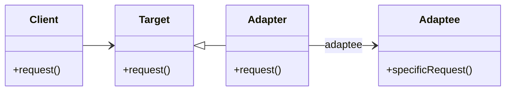

# Adapter Pattern

The Adapter Pattern is a structural design pattern that allows objects with incompatible interfaces to work together. It acts as a bridge between two incompatible interfaces.

---

## 📖 What is the Adapter Pattern?

The Adapter Pattern converts the interface of a class into another interface that the client expects. It allows classes with incompatible interfaces to work together without changing their existing code.

Key features:
1. **Compatibility**: Enables objects with incompatible interfaces to interact.
2. **Reusability**: Reuses existing code without modification.
3. **Flexibility**: Adapts interfaces dynamically at runtime.

---

## 🤔 Why Use the Adapter Pattern?

1. **Legacy Code**: Integrate legacy components with new systems.
2. **Third-Party Libraries**: Adapt third-party libraries to fit your application's needs.
3. **Interface Mismatch**: Resolve incompatibilities between interfaces.

---

## 🔧 Implementation

The implementation of the Adapter Pattern can be found in:
- [`RoundHole.java`](./RoundHole.java): Represents the round hole (**Client**).
- [`RoundPeg.java`](./RoundPeg.java): Represents a round peg (**Target**).
- [`SquarePeg.java`](./SquarePeg.java): Represents a square peg (incompatible **Adaptee**).
- [`SquarePegAdapter.java`](./SquarePegAdapter.java): **Adapter** to make a square peg fit into a round hole.
- [`Main.java`](./Main.java): Demonstrates the usage of the Adapter Pattern.

---

## 🛠️ Example Usage

To see the Adapter Pattern in action, refer to the [`Main.java`](./Main.java) file. It demonstrates how to use the adapter to fit a square peg into a round hole.

---

## 📊 UML Diagram

> [!NOTE]
> If the UML above is not rendering correctly, you can view the diagram from the [`adapter_uml.png`](./adapter_uml.png) file.
---

## 📝 Key Takeaways

- The Adapter Pattern is ideal for bridging incompatible interfaces.
- It enables flexibility and code reuse without modifying existing code.
- Use it when you need to integrate systems with incompatible interfaces.

---
