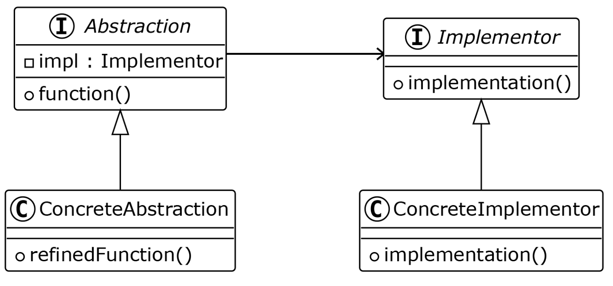

# Bridge Pattern

The Bridge Pattern is a structural design pattern that decouples an abstraction from its implementation so that the two can vary independently.

---

## 📖 What is the Bridge Pattern?

The Bridge Pattern uses composition to separate abstraction from implementation. It enables changes in both the abstraction and implementation without affecting each other.

Key features:
1. **Decoupling**: Separates abstraction and implementation into two separate hierarchies.
2. **Flexibility**: Both hierarchies can evolve independently.
3. **Composition over Inheritance**: Promotes the use of composition rather than inheritance for flexibility.

---

## 🤔 Why Use the Bridge Pattern?

1. **Independence**: Decouples abstraction and implementation to evolve independently.
2. **Scalability**: Allows adding new abstractions or implementations without modifying existing code.
3. **Complexity Management**: Simplifies complex systems by separating responsibilities.

---

## 🔧 Implementation

The implementation of the Bridge Pattern can be found in:
- [`View.java`](./View.java): Abstract interface for all views.
- [`CompactView.java`](./CompactView.java), [`WideView.java`](./WideView.java), [`DetailedView.java`](./DetailedView.java): Concrete abstractions for different views.
- [`Resource.java`](./Resource.java): Abstract interface for resources.
- [`Artist.java`](./Artist.java), [`Song.java`](./Song.java), [`Album.java`](./Album.java): Concrete implementations of resources.
- [`Main.java`](./Main.java): Demonstrates the usage of the Bridge Pattern.

---

## 🛠️ Example Usage

To see the Bridge Pattern in action, refer to the [`Main.java`](./Main.java) file. It demonstrates how to create views with different resources dynamically.

---

## 📊 UML Diagram

Here’s the UML representation of the Bridge Pattern:

---

## 📝 Key Takeaways

- The Bridge Pattern separates abstraction from implementation, allowing them to vary independently.
- It promotes flexibility and scalability in systems with multiple abstractions and implementations.
- Use it when abstraction and implementation need to evolve independently.

---
