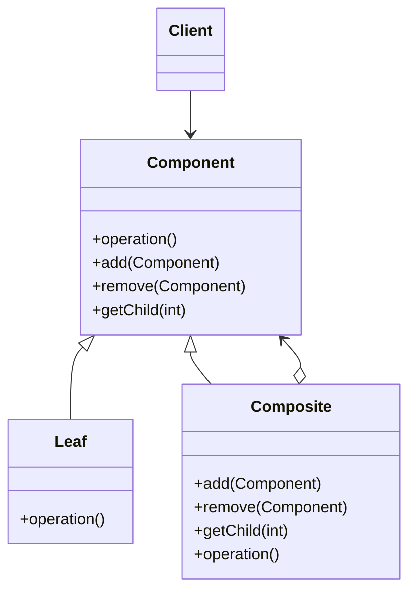

# Composite Pattern

The Composite Pattern is a structural design pattern that allows you to compose objects into tree structures to represent part-whole hierarchies. It lets clients treat individual objects and compositions of objects uniformly.

---

## 📖 What is the Composite Pattern?

The Composite Pattern organizes objects into tree structures, where individual objects and groups of objects (composites) are treated in the same way. This is particularly useful for representing hierarchies.

Key features:
1. **Tree Structure**: Represents part-whole hierarchies.
2. **Uniformity**: Treats individual objects and composites uniformly.
3. **Scalability**: Easily adds new components without modifying existing code.

---

## 🤔 Why Use the Composite Pattern?

1. **Hierarchical Data**: Manage and manipulate hierarchical data efficiently.
2. **Uniform Interface**: Treats individual components and composites the same way.
3. **Scalability**: Easily extendable by adding new types of components.

---

## 🔧 Implementation

The implementation of the Composite Pattern can be found in:
- [`Task.java`](./Task.java): Common interface for all tasks.
- [`LeafTask.java`](./LeafTask.java): Represents individual tasks.
- [`CompositeTask.java`](./CompositeTask.java): Represents a composite of tasks.
- [`ToDoListExample.java`](./ToDoListExample.java): Demonstrates the usage of the Composite Pattern.

---

## 🛠️ Example Usage

To see the Composite Pattern in action, refer to the [`ToDoListExample.java`](./ToDoListExample.java) file. It demonstrates a task hierarchy where leaf tasks and composite tasks are treated uniformly.

---

## 📊 UML Diagram

> [!NOTE]
> If the UML above is not rendering correctly, you can view the diagram from the [`composite_uml.png`](./composite_uml.png) file.

---

## 📝 Key Takeaways

- The Composite Pattern is ideal for managing and manipulating hierarchical data.
- It treats individual objects and composites uniformly.
- Use it when working with tree structures or part-whole hierarchies.

---
