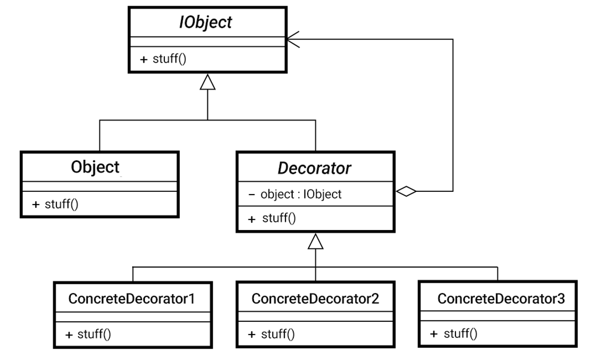

# Decorator Pattern

The Decorator Pattern is a structural design pattern that allows behavior to be added to individual objects, dynamically, without affecting the behavior of other objects from the same class.

---

## 📖 What is the Decorator Pattern?

The Decorator Pattern wraps an object to add new behaviors or responsibilities. Each wrapper, or decorator, adds functionality to the base object while maintaining its interface.

Key features:
1. **Dynamic Behavior**: Add responsibilities to objects dynamically at runtime.
2. **Composability**: Combine multiple decorators to create complex behaviors.
3. **Open/Closed Principle**: Extend an object's behavior without modifying its existing code.

---

## 🤔 Why Use the Decorator Pattern?

1. **Customization**: Add new behavior to individual objects without altering the original class.
2. **Scalability**: Combine multiple decorators for complex use cases.
3. **Flexibility**: Avoid subclassing by using composition to add behaviors.

---

## 🔧 Implementation

The implementation of the Decorator Pattern can be found in:
- [`Beverage.java`](./Beverage.java): Abstract component interface.
- [`Espresso.java`](./Espresso.java), [`HouseBlend.java`](./HouseBlend.java), [`DarkRoast.java`](./DarkRoast.java): Concrete components.
- [`CondimentDecorator.java`](./CondimentDecorator.java): Abstract decorator class.
- [`Mocha.java`](./Mocha.java), [`Whip.java`](./Whip.java), [`Soy.java`](./Soy.java): Concrete decorators.
- [`CoffeeHouse.java`](./CoffeeHouse.java): Client code to demonstrate the Decorator Pattern.

---

## 🛠️ Example Usage

To see the Decorator Pattern in action, refer to the [`CoffeeHouse.java`](./CoffeeHouse.java) file. It demonstrates how to dynamically add condiments to beverages using decorators.

---

## 📊 UML Diagram

Here’s the UML representation of the Decorator Pattern:

---

## 📝 Key Takeaways

- The Decorator Pattern is ideal for dynamically extending the behavior of objects.
- It adheres to the Open/Closed Principle by allowing objects to be extended without modifying their code.
- Use it when subclassing becomes impractical or leads to an explosion of classes.

---
