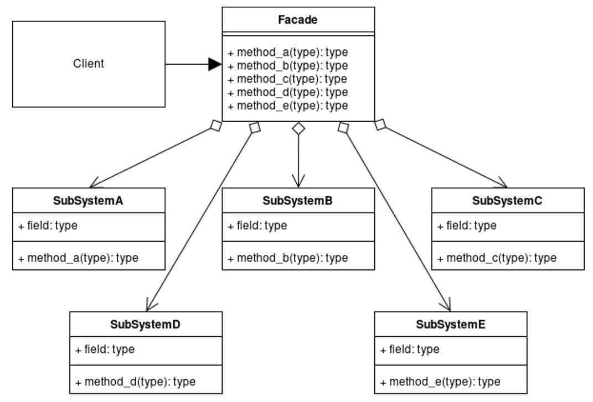

# Facade Pattern

The Facade Pattern is a structural design pattern that provides a simplified interface to a larger, more complex subsystem.

---

## 📖 What is the Facade Pattern?

The Facade Pattern provides a high-level interface that makes a subsystem easier to use. It hides the complexities of the subsystem and provides a unified interface for the client.

Key features:
1. **Simplified Interface**: Reduces the complexity of interacting with a subsystem.
2. **Decoupling**: Decouples the client code from the subsystem.
3. **Flexibility**: Makes it easier to update or replace subsystems.

---

## 🤔 Why Use the Facade Pattern?

1. **Ease of Use**: Simplifies the interface to a complex subsystem.
2. **Decoupling**: Reduces dependencies between the client and the subsystem.
3. **Readability**: Improves code readability by hiding implementation details.

---

## 🔧 Implementation

The implementation of the Facade Pattern can be found in:
- [`HomeTheaterFacade.java`](./HomeTheaterFacade.java): The facade class that provides a simplified interface.
- [`Amplifier.java`](./Amplifier.java), [`DVDPlayer.java`](./DVDPlayer.java), [`Projector.java`](./Projector.java): Subsystem classes.
- [`Main.java`](./Main.java): Demonstrates the usage of the Facade Pattern.

---

## 🛠️ Example Usage

To see the Facade Pattern in action, refer to the [`Main.java`](./Main.java) file. It demonstrates how to use the facade to simplify interactions with a home theater system.

---

## 📊 UML Diagram

Here’s the UML representation of the Facade Pattern:

---

## 📝 Key Takeaways

- The Facade Pattern simplifies interactions with complex subsystems by providing a high-level interface.
- It decouples the client from the subsystem, improving flexibility and maintainability.
- Use it when you want to simplify the interface to a complex subsystem.

---
