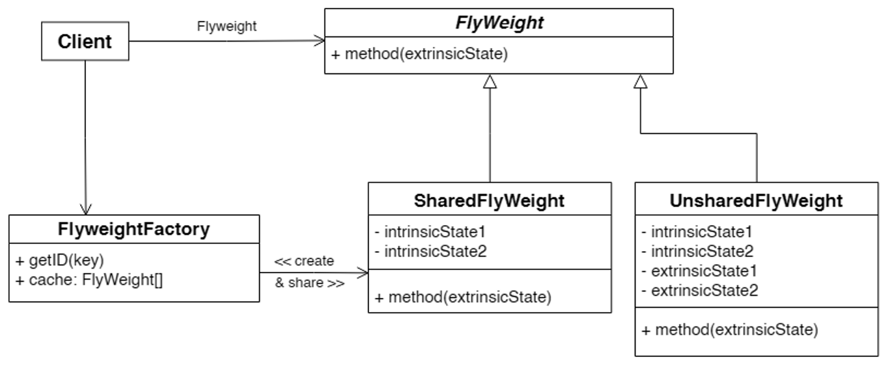

# Flyweight Pattern

The Flyweight Pattern is a structural design pattern that minimizes memory usage by sharing common parts of state between multiple objects.

---

## 📖 What is the Flyweight Pattern?

The Flyweight Pattern reduces memory usage by sharing as much data as possible between similar objects. This is achieved by separating intrinsic (shared) and extrinsic (unique) states.

Key features:
1. **Shared State**: Intrinsic state is shared between objects.
2. **Reduced Memory Usage**: Minimize memory overhead by reusing existing objects.
3. **Performance Optimization**: Suitable for large numbers of similar objects.

---

## 🤔 Why Use the Flyweight Pattern?

1. **Memory Efficiency**: Reduces memory consumption for large numbers of objects.
2. **Reusability**: Encourages reuse of shared states.
3. **Performance**: Optimizes performance in scenarios with many similar objects.

---

## 🔧 Implementation

The implementation of the Flyweight Pattern can be found in:
- [`Shapes.java`](./Shapes.java): Common interface for all shapes.
- [`Circle.java`](./Circle.java): Concrete flyweight class.
- [`ShapeFactory.java`](./ShapeFactory.java): Factory for managing flyweights.
- [`Main.java`](./Main.java): Demonstrates the usage of the Flyweight Pattern.

---

## 🛠️ Example Usage

To see the Flyweight Pattern in action, refer to the [`Main.java`](./Main.java) file. It demonstrates how to reuse shapes with shared properties.

---

## 📊 UML Diagram

Here’s the UML representation of the Flyweight Pattern:

---

## 📝 Key Takeaways

- The Flyweight Pattern is ideal for optimizing memory usage when dealing with many similar objects.
- Use it when you need a large number of objects that share most of their state.
- It reduces memory overhead by sharing intrinsic state between objects.

---
