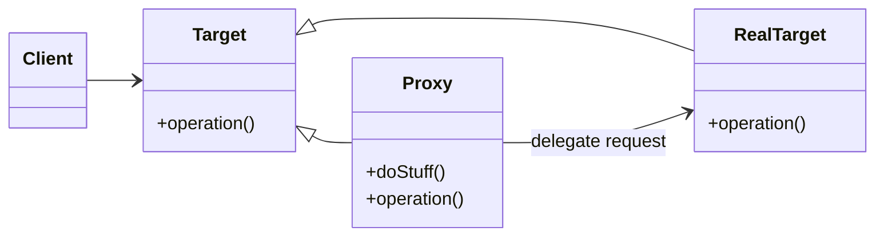

# Proxy Pattern

The Proxy Pattern is a structural design pattern that provides a surrogate or placeholder for another object to control access to it.

---

## 📖 What is the Proxy Pattern?

The Proxy Pattern acts as an intermediary between a client and a real object. It allows you to control access, manage performance, or add additional functionality without modifying the real object.

Key features:
1. **Access Control**: Controls access to the real object.
2. **Lazy Initialization**: Delays object creation until it's needed.
3. **Additional Functionality**: Adds functionality without changing the real object's code.

---

## 🤔 Why Use the Proxy Pattern?

1. **Security**: Control access to sensitive objects.
2. **Performance**: Manage resource-intensive objects by lazy-loading.
3. **Logging or Caching**: Add logging, caching, or other operations transparently.

---

## 🔧 Implementation

The implementation of the Proxy Pattern can be found in:
- [`Subject.java`](./Subject.java): Common interface for RealSubject and Proxy (**Target**).
- [`RealSubject.java`](./RealSubject.java): Represents the real object (**RealTarget**).
- [`Proxy.java`](./Proxy.java): Controls access to the RealSubject (**Proxy**).
- [`Main.java`](./Main.java): Demonstrates the usage of the Proxy Pattern (**Client**).

---

## 🛠️ Example Usage

To see the Proxy Pattern in action, refer to the [`Main.java`](./Main.java) file. It demonstrates access control using a proxy.

---

## 📊 UML Diagram

> [!NOTE]
> If the UML above is not rendering correctly, you can view the diagram from the [`proxy_uml.png`](./proxy_uml.png) file.

---

## 📝 Key Takeaways

- The Proxy Pattern is ideal for controlling access to objects.
- It adds functionality like logging, security, or caching without modifying the real object.
- Use it when you need an intermediary to control or enhance access to objects.

---
